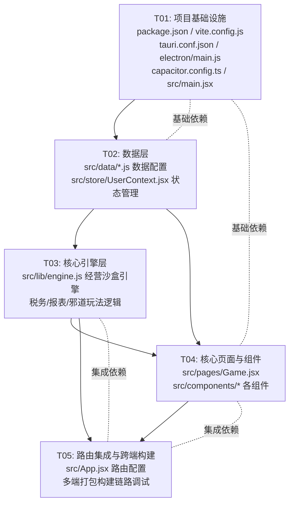
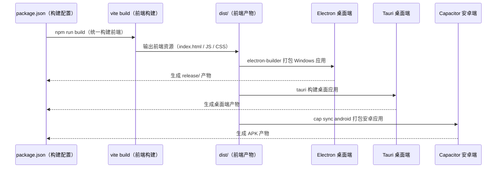

# ARCHITECT_架构与工程评审

## 评审信息

| 项目 | 内容 |
|------|------|
| **评审时间** | 2026-09-28 |
| **评审范围** | 「会计小当家」项目 v2.0.4 整体架构与技术工程化评审 |
| **评审人** | 高见远（软件架构师） |
| **评审对象** | 核心源码（engine.js / Game.jsx / App.jsx / UserContext.jsx / 各组件 / 数据配置）、跨端工程配置（package.json / vite.config.js / tauri.conf.json / electron/main.js / capacitor.config.ts） |

---

## 目录

1. [整体架构合理性](#一整体架构合理性)
2. [状态管理架构](#二状态管理架构)
3. [模块解耦与工程化](#三模块解耦与工程化)
4. [核心逻辑设计风险](#四核心逻辑设计风险)
5. [架构侧完善建议](#五架构侧完善建议)
6. [任务依赖图](#六任务依赖图)
7. [附录：关键流程说明](#附录关键流程说明)

---

## 一、整体架构合理性

### 1.1 前后端分层与核心引擎-UI 解耦评估

**评估结论：分层合理，引擎与 UI 解耦程度良好，具备可维护性。**

本项目为游戏类应用，核心会计经营逻辑全部封装在纯 JavaScript 模块 `src/lib/engine.js` 中，不依赖任何前端框架或运行时，属于**纯逻辑层**。该模块对外暴露函数式接口（如 `createCompany`、`applyBusiness`、`monthEnd`、`buildReports`、`settleTax` 等），通过入参 `state` 读写状态，无副作用依赖框架，天然满足前端纯逻辑层的解耦要求。

UI 层 `src/pages/Game.jsx` 承担页面交互、状态编排与结果展示职责，不重写核心会计逻辑，而是通过调用引擎函数实现业务。例如：

- 引擎 `monthEnd()` 负责计提折旧、计息、摊销、结转损益、邪道玩法触发等核心经营逻辑；
- `Game.jsx` 仅负责编排调用时序（`monthEnd` → `endOfMonthExtras` → `settleErrors` → `analyzeDecision`），将引擎结果渲染为 UI 组件（报表卡片、账本展示、诊断信息）。

**判断依据**：`engine.js` 内部无 React 依赖，仅 `import { getCompany } from '../data/companies.js'`，与 UI 零耦合；`Game.jsx` 的每个引擎调用均有对应 UI 渲染逻辑，职责边界清晰。

### 1.2 跨端架构一致性评估

**评估结论：跨端核心逻辑共享合理，但存在构建平台限制与配置未平台化等架构冲突。**

项目采用 **Vite 前端 + Electron（Windows 桌面）+ Tauri 2（桌面）+ Capacitor（安卓原生）** 的多端架构，核心逻辑一致性设计良好：

- 核心引擎 `engine.js` 为纯 JavaScript 模块，**平台无关**，Electron 与 Tauri 桌面端、Capacitor 安卓端均共享同一份引擎代码，不存在核心逻辑重复。
- `src/data/*.js` 数据配置（公司类型、剧情、等级等）同样为纯数据文件，三端共用，配置一致性有保障。

**存在的架构冲突与问题：**

| 问题 | 影响 | 风险等级 |
|------|------|----------|
| Tauri 构建仅配置 `nsis` 目标，不支持 Linux/macOS 跨平台构建 | 项目声明多端支持，但 Tauri 路径仅实现 Windows 桌面端，与跨端目标冲突 | 🔴 高风险 |
| 三端（Tauri/Electron/Capacitor）共用 `com.accounting.game` 标识符，未按平台定制 | 标识符不具平台区分性，增加多平台分发时的配置混乱风险 | 🟡 中风险 |
| Tauri 与 Electron 前端构建产物路径不同（Tauri 指向 `dist/`，Electron 指向 `dist/` 但打包至 `release/`） | 产物路径管理不统一，跨端构建时易混淆 | 🟡 中风险 |

**判断依据**：`tauri.conf.json` 中 `bundle.targets: ["nsis"]` 明确仅支持 Windows 安装包；`package.json` 中 Tauri 命令与 Electron 打包命令独立，配置分散；三端 `appId` 均硬编码为 `com.accounting.game`。

### 1.3 整体架构合理性总结

```
┌─────────────────────────────────────────────────────────┐
│                    多端应用层（UI 层）                      │
│   Electron(Windows) │ Tauri(桌面) │ Capacitor(安卓)        │
│   ┌─────────────────┼───────────┼──────────────────────┐ │
│   │   共享 React 前端 │           │                       │ │
│   └────────┬─────────┴───────────┴──────────┬───────────┘ │
│            │                                │              │
│   Game.jsx  │   components/                  │              │
│   App.jsx   │   store/UserContext             │              │
│   main.jsx  │   data/*.js (数据配置)           │              │
└────────────┴───────────────────────────────────┴────────────┘
        │                                │
        └───────────────────────────────┘
                      │
              ┌───────▼────────┐
              │  engine.js     │
              │  (纯逻辑引擎层)  │
              │  跨端共享、无框架 │
              └────────────────┘
```

---

## 二、状态管理架构

### 2.1 UserContext 状态管理评估

**评估结论：UserContext 的状态管理方案合理，覆盖了用户级数据的完整性，满足本地持久化与刷新需求。**

`src/store/UserContext.jsx` 采用 **`useReducer` + `localStorage` 持久化** 方案：

- **状态结构**：`defaultState` 定义用户基础状态（`name`、`coins`、`exp`、`level`、`tier`、`badges`、`gameBestProfit`、`runHistory` 等），完整覆盖用户数据、成就、排行等场景需求。
- ** reducer**：定义 10 种 action（`ADD_COINS`、`ADD_EXP`、`COMPLETE_LEVEL`、`EARN_BADGE`、`SET_GAME_BEST`、`SET_TIER`、`COMPANY_RUN`、`RECORD_RUN`、`SET_NAME`、`RESET`），每种 action 均有明确的状态更新逻辑，如 `EARN_BADGE` 含去重判断、`SET_GAME_BEST` 含成就解锁逻辑。
- **持久化**：`useEffect` 中自动将 `state` 写入 `localStorage`，刷新时从 `localStorage` 恢复，保证用户进度持久化。

**判断依据**：状态设计完整、reducer 逻辑严谨（含去重、边界判断），持久化机制可靠，满足用户状态管理与刷新恢复需求。

### 2.2 引擎 State 与 UI 状态分工评估

**评估结论：引擎 state 与 UI state 分工基本清晰，但存在大型状态频繁克隆的性能隐患。**

| 状态类型 | 承载内容 | 管理方式 | 分工合理性 |
|----------|----------|----------|-----------|
| **引擎 State**（`sim`） | 科目余额、凭证、账本、邪道玩法数据、月度经营状态等核心游戏数据 | `useState` 持有，引擎函数原地修改后返回 | 合理，核心经营数据集中管理 |
| **UI State**（`saved`/`phase`/`stepIdx`/`reports` 等） | 页面阶段、步骤索引、报表对象、弹窗状态等 UI 衍生状态 | `useState` 局部管理 | 合理，UI 交互状态独立管理 |

**分工判断依据**：核心经营状态（`sim`）由引擎管理并随业务操作变更，UI 交互状态（phase、stepIdx、reports 等）由页面本地管理，职责边界清晰，不存在职责混淆。

**存在的状态管理风险：**

1. **大型状态对象频繁克隆**：`Game.jsx` 中每次引擎操作前均通过 `clone()`（`JSON.parse(JSON.stringify(sim))`）克隆 `sim` 状态，`sim` 包含余额、账本、凭证、大量邪道玩法字段等，数据体积较大。在 `React.StrictMode` 双重渲染下会进一步加剧克隆开销，存在潜在性能瓶颈。

   **风险等级**：🟡 中风险

2. **两套状态来源的潜在同步风险**：引擎状态 `sim` 通过 `writeSave`/`loadSave` 持久化到 localStorage，UserContext 状态同样持久化。两者为独立存储，若操作序列中状态更新与持久化未严格对齐，可能出现短暂不一致。

   **风险等级**：🟢 低风险（当前代码中 `sim` 与用户状态更新均有独立持久化，实际风险可控）

### 2.3 状态管理架构总结

状态管理整体采用分层设计：UserContext 负责用户级状态持久化，Game.jsx 负责核心经营状态（`sim`）的持有与编排，UI 状态局部管理。分工基本合理，但大型状态频繁克隆是需优化的性能隐患。

---

## 三、模块解耦与工程化

### 3.1 模块划分与依赖关系评估

**评估结论：模块划分清晰，依赖关系明确，无循环依赖风险。**

```
src/
├── lib/
│   └── engine.js          # 纯逻辑引擎层（无框架依赖，跨端共享）
├── store/
│   └── UserContext.jsx    # 用户状态管理（useReducer + localStorage）
├── data/
│   ├── companies.js       # 公司类型与经营参数配置
│   ├── story.js           # 章节剧情配置
│   ├── tiers.js           # 职称配置
│   └── badges.js          # 成就配置
├── pages/
│   ├── Game.jsx           # 核心游戏页面（引擎编排与交互）
│   ├── Home.jsx           # 首页
│   ├── Reports.jsx        # 报表页面
│   └── Me.jsx             # 我的页面
├── components/
│   ├── Toast.jsx          # 全局提示组件
│   ├── TopBar.jsx         # 顶栏组件
│   ├── BottomNav.jsx      # 底部导航组件
│   ├── EntryAnimation.jsx # 分录动画组件
│   └── ReportView.jsx     # 报表可视化组件
├── styles/
│   └── global.css         # 全局样式
├── App.jsx                # 应用路由（React Router）
└── main.jsx               # 应用入口
```

**依赖关系分析**：

- `engine.js` 仅依赖 `data/companies.js`（数据配置），无框架、无 UI 依赖，无循环依赖。
- `Game.jsx` 依赖 `engine.js`（引擎）、`data/*.js`（数据）、`components/*`（UI 组件）、`store/UserContext.jsx`（状态），依赖方向单向，无循环。
- `components/*` 依赖 `store` 或 `data` 文件，不反向依赖页面或引擎，解耦良好。

**判断依据**：模块按功能分层（引擎层 / 数据层 / 状态层 / 页面层 / 组件层），依赖方向单一，不存在循环依赖。

### 3.2 构建链路评估

**评估结论：构建链路基本合理，但多路径配置分散，缺乏统一协调机制。**

项目构建链路为：

```
npm run build (vite build) → dist/
        │
        ├── npm run pack (electron-builder --win dir) → release/  ← Electron Windows
        ├── npm run tauri (tauri) → dist/ → 桌面应用              ← Tauri
        └── npm run android:build (cap sync android) → APK       ← Capacitor 安卓
```

**链路合理性判断**：

- Vite 构建将前端资源输出至 `dist/`，为 Electron、Tauri、Capacitor 三端共用前置产物，链路连贯。
- 三端打包命令独立配置于 `package.json`，分别对应不同产物，链路设计可满足多端打包需求。

**存在的工程化问题：**

| 问题 | 影响 | 风险等级 |
|------|------|----------|
| 构建产物路径管理不统一（`dist/` 与 `release/` 并存） | 跨端构建时产物混淆，路径管理缺乏统一规范 | 🟡 中风险 |
| 多构建路径缺乏统一构建协调脚本 | 多平台构建时易遗漏前置步骤或出错，维护成本高 | 🟡 中风险 |

### 3.3 依赖配置评估

**评估结论：依赖配置基本合理，`allowScripts` 配置正确，但产物命名冗余。**

**依赖分析**：

- 前端核心依赖：`react@^18.3.1`、`react-dom@^18.3.1`、`react-router-dom@^6.26.2`、`vite@^5.4.8`、`@vitejs/plugin-react@^4.3.1`，版本匹配合理。
- 跨端依赖：`@capacitor/*@^6.2.1`、`electron@^33.2.0`、`electron-builder@^25.1.8`、`@tauri-apps/cli@^2.11.4`，覆盖三端需求。

**配置问题：**

1. **产物命名冗余**：`package.json` 的 `build` 配置中同时存在根级 `artifactName` 和 `portable.artifactName`，重复定义，虽不影响功能但缺乏清晰管理。
2. **Vite `base` 配置为 `'./'`**：适用于 Electron/Capacitor 本地加载，但需注意若需通过 HTTP 访问需调整，当前配置符合多端打包场景。

### 3.4 工程化风险总结

工程化方面整体配置规范，依赖合理、构建链路连贯，主要风险集中在**构建产物路径管理不统一**与**多构建路径缺乏统一协调**，需通过规范化路径管理脚本与统一构建入口予以解决。

---

## 四、核心逻辑设计风险

### 4.1 核心逻辑正确性评估

**评估结论：核心会计逻辑设计正确，权责发生制、借贷平衡、税务计算、邪道玩法逻辑均符合教学需求，具备正确性。**

| 核心逻辑模块 | 实现要点 | 正确性判断 |
|-------------|----------|-----------|
| **科目记账** | `applyBusiness` 基于科目性质（`NATURE` 映射：借增贷减/贷增借减）更新余额，通过 `bump` 函数计算变动 | ✅ 正确，借贷方向逻辑严谨 |
| **余额恒等校验** | `buildReports` 通过 `sumAccount` 汇总资产负债表三要素，前端 `ReportView` 本地校验资产 = 负债 + 权益 | ✅ 正确，逻辑与会计恒等式一致 |
| **报表勾稽** | 利润表优先使用 `cum` 累计损益（月末清零后还原），现金流表采用间接法并基于累计余额与资产负债表勾稽 | ✅ 正确，特殊场景处理得当，勾稽关系成立 |
| **税务计算** | `settleTax` 区分小规模/一般纳税人增值税计算，含小型微利优惠、研发加计扣除、强制转一般纳税人规则，区分合法避税与邪道偷逃 | ✅ 正确，税法规则准确，合法/违规边界清晰 |
| **邪道玩法触发** | `evilSalary`/`evilTaxAdjust`/`evilTaxOwe`/`evilFakeInvoice` 记录违规次数，后续稽查/罢工/爆雷概率按违规数放大，恶果延迟数年爆发 | ✅ 正确，风险累积逻辑符合游戏教学设计 |

### 4.2 核心逻辑可维护性评估

**评估结论：核心逻辑封装良好，但部分复杂逻辑存在脆弱性与可维护性隐患。**

**优势**：

- 引擎为纯函数式设计，状态通过 `state` 入参传递，函数返回更新后的 state，符合函数式编程原则，逻辑可独立测试。
- 核心逻辑集中于 `engine.js`，数据配置与逻辑分离，修改配置不影响引擎逻辑。

**存在隐患：**

| 隐患 | 描述 | 风险等级 |
|------|------|----------|
| **月末结账损益科目清空逻辑脆弱** | `monthEnd` 中损益科目清空逻辑含大量注释（388-393 行重复注释块），涉及所得税费用不清空的特殊处理，逻辑复杂且经多次修订，易引发重复扣除或恒等式失衡 | 🔴 高风险 |
| **层级科目匹配依赖字符串约定** | 层级科目（如 `管理费用-工资`、`应交税费-销项`）通过 `split('-')[0]` 与 `startsWith` 匹配，无集中式科目注册表，命名约定脆弱，易因改名导致逻辑失效 | 🟡 中风险 |
| **引擎状态原地修改** | 引擎函数原地修改 `state` 并返回同一引用，虽功能正常但缺乏不可变状态管理，在并发场景下易产生隐式副作用 | 🟡 中风险 |
| **缺乏引擎核心逻辑单元测试** | 引擎为纯逻辑模块，具备测试条件，但当前无对应单元测试保障，复杂逻辑（税务、报表、邪道玩法）的边界与异常场景缺乏自动化验证 | 🟢 低风险 |

### 4.3 跨端核心逻辑一致性评估

**评估结论：跨端核心逻辑完全一致，无重复或冲突。**

本项目核心逻辑全部实现于纯 JavaScript 模块 `engine.js`，未做任何平台相关的逻辑分支或差异处理。Electron 桌面端、Tauri 桌面端、Capacitor 安卓端均共享同一份 `engine.js` 与 `data/*.js` 配置，核心经营逻辑（科目记账、税务、报表、邪道玩法）完全一致，不存在跨端重复实现或逻辑冲突。

**判断依据**：`engine.js` 无任何平台环境判断（如 `window`/`document`/`os` 平台检测），为纯通用逻辑，三端共享无差异。

### 4.4 核心逻辑风险总结

核心逻辑设计整体正确、封装良好，跨端完全一致。主要风险集中在**月末结账损益清空逻辑的脆弱性**与**层级科目匹配的字符串约定脆弱性**，前者为高风险隐患，需优先重构与测试保障。

---

## 五、架构侧完善建议

### 5.1 P0 高优建议（必须优先解决）

#### 建议 1：修复 Tauri 仅支持 Windows 构建的跨端限制

- **问题依据**：`tauri.conf.json` 中 `bundle.targets: ["nsis"]` 仅配置 Windows 安装包，项目声明多端支持但 Tauri 路径仅实现 Windows 桌面端，与跨端架构目标冲突。
- **建议内容**：
  - 在 `tauri.conf.json` 的 `bundle.targets` 中补充 Linux、macOS 目标（如 `["nsis", "app-image", "deb", "dmg"]`，按目标平台分别配置）；
  - 按平台调整 Tauri 应用标识符（桌面端标识符应遵循各平台规范，不应与 Capacitor 安卓 `com.*` 标识符混淆）；
  - 在 `package.json` 中为各平台构建命令补充明确的分平台脚本，确保跨平台构建可执行。
- **影响**：解决跨端架构的核心矛盾，支撑项目多端支持目标，避免平台限制导致的架构冲突。

#### 建议 2：重构月末结账损益科目清空逻辑并补充单元测试

- **问题依据**：`monthEnd` 中损益科目清空逻辑（388-393 行）含重复注释、复杂特殊处理（所得税费用不清空），逻辑脆弱，经多次修订存在重复扣除或恒等式失衡风险，且无自动化测试保障。
- **建议内容**：
  - 将损益科目清空逻辑提取为独立的、命名清晰的函数（如 `clearMonthPnLAccount(state)`），并添加详尽文档注释说明逻辑依据（权责发生制、所得税跨月管理规则等）；
  - 新增引擎核心逻辑单元测试，重点覆盖损益清空边界场景：全科目清零、子科目清理、所得税费用不清空、新科目添加后清空逻辑等；
  - 在测试中验证资产负债表恒等式（资产 = 负债 + 权益）在结账后始终成立，确保报表平衡性。
- **影响**：消除高风险隐患，保障核心经营逻辑正确性，通过测试保障复杂逻辑的健壮性。

### 5.2 P1 中优建议（建议尽快实施）

#### 建议 3：建立集中式科目注册表，统一科目管理与校验

- **问题依据**：层级科目（如 `管理费用-工资`、`应交税费-销项`）通过 `split('-')[0]` 与 `startsWith` 匹配，科目名称、性质映射分散于 `engine.js` 的 `NATURE` 映射与 `ALL_ACCOUNTS` 列表，缺乏集中注册表，命名约定脆弱，易因科目变更引入逻辑错误。
- **建议内容**：
  - 在 `engine.js` 或独立的 `data/accounts.js` 中建立集中式科目注册表，包含科目名称、科目性质、父科目映射、层级路径等元信息；
  - 引擎函数、`Game.jsx` 的 `EntryForm`、`buildReports` 等模块统一从注册表读取科目信息，消除字符串匹配逻辑；
  - 增加科目名称/性质的输入校验，防止非法科目导致运行时错误。
- **影响**：提升科目管理的一致性，消除命名约定脆弱性，增强代码可维护性与健壮性。

#### 建议 4：规范化构建产物路径与多构建协调机制

- **问题依据**：构建产物路径管理不统一（`dist/` 与 `release/` 并存），多构建路径缺乏统一协调脚本，跨端构建易混淆、易出错，维护成本高。
- **建议内容**：
  - 定义统一的产物路径规范：明确 `dist/` 为前端构建产物（三端共用），`release/` 为 Electron 打包产物目录，各平台产物目录独立管理；
  - 在 `package.json` 中创建统一构建协调脚本（如 `build-all`），串联 Vite 构建、各平台打包流程，统一错误处理与产物校验；
  - 规范产物命名规则，消除 `artifactName` 冗余定义，确保产物命名清晰可追溯。
- **影响**：提升构建流程规范性与可维护性，降低跨端构建出错概率，提升多平台构建效率。

#### 建议 5：优化大型状态对象处理性能，缓解频繁克隆开销

- **问题依据**：`Game.jsx` 中大型 `sim` 状态（余额、账本、凭证、邪道玩法等）每次操作前通过 `clone()`（JSON 深拷贝）克隆，在 `React.StrictMode` 双重渲染下加剧性能开销，存在潜在性能瓶颈。
- **建议内容**：
  - 评估 `sim` 状态更新频率，对于高频更新的子状态（如账本、凭证）可考虑引入受控状态更新策略，减少全量克隆；
  - 若状态规模持续增大，可考虑引入状态管理工具（如 Zustand），或采用 Ref + 局部更新模式，避免全量深拷贝；
  - 在开发阶段通过性能监控定位高频克隆场景，针对性优化。
- **影响**：提升游戏运行性能，保障低端设备流畅性，解决状态管理性能隐患。

### 5.3 P2 低优建议（可后续迭代）

#### 建议 6：补充引擎核心逻辑单元测试

- **建议内容**：为引擎 `engine.js` 核心函数补充单元测试，覆盖税务计算、报表生成、邪道玩法触发、月度结账、余额校验等核心逻辑，包括正常场景与边界场景。
- **影响**：通过自动化测试保障核心逻辑正确性，提升代码可测试性与迭代质量，为后续功能扩展提供保障。

#### 建议 7：增强构建与运行时错误结构化日志

- **建议内容**：在构建与运行时引入结构化错误日志，替代部分 `console.error`，包含错误上下文（模块、调用栈、输入参数）与错误类型，便于生产环境排查。
- **影响**：提升问题定位效率，优化工程化可观测性，降低故障排查成本。

---

## 六、任务依赖图



---

## 附录：关键流程说明

### 附录 A：核心经营流程（月度经营生命周期）

```mermaid
sequenceDiagram
    participant UI as Game.jsx（UI层）
    participant ENG as engine.js（引擎层）
    participant DATA as data/*.js（数据层）
    participant SAVE as localStorage（存档）

    UI->>>DATA: createCompany(companyId, difficulty, projectId)
    DATA-->>UI: state（空壳初始状态）

    UI->>>ENG: runSpecial(state, action) / doBusiness(state, action)
    ENG->>>DATA: getCompany(state.co) / INITIAL_BALANCES
    ENG->>>ENG: applyBusiness(state, entries, desc, month)
    ENG-->>UI: state（业务操作后更新状态）

    UI->>>ENG: monthEnd(state)
    ENG->>>DATA: sumAccount / totalAssets（数据汇总）
    ENG->>>ENG: 计提折旧/计息/摊销/结转损益/邪道触发
    ENG-->>UI: state（月末结账后状态）

    UI->>>ENG: endOfMonthExtras(state)
    ENG-->>UI: 应收/应付到期、随机事件、里程碑结果

    UI->>>ENG: buildReports(state) / scoreMetrics(state)
    ENG-->>UI: 报表对象 / 评分指标

    UI->>>SAVE: writeSave(state) / loadSave()
    SAVE-->>UI: 存档状态（刷新恢复）

    UI->>>ENG: settleErrors(state) / analyzeDecision(before, after, action)
    ENG-->>UI: 纠错结果 / 决策诊断信息
```

### 附录 B：三端跨端架构流程



---

## 附录 C：风险等级汇总

| 风险编号 | 风险描述 | 风险等级 | 优先级 |
|----------|----------|----------|--------|
| R1 | Tauri 构建仅支持 Windows，与跨端目标冲突 | 🔴 高风险 | P0 |
| R2 | 大型状态对象频繁克隆，存在性能隐患 | 🟡 中风险 | P1 |
| R3 | 月末结账损益科目清空逻辑脆弱 | 🔴 高风险 | P0 |
| R4 | 三端共用未平台化的标识符 | 🟡 中风险 | P1 |
| R5 | 层级科目匹配依赖字符串约定，缺乏集中校验 | 🟡 中风险 | P1 |
| R6 | 构建产物路径管理不统一 | 🟡 中风险 | P1 |
| R7 | 核心逻辑缺乏单元测试保障 | 🟢 低风险 | P2 |
| R8 | 资产负债表平衡校验为前端本地校验 | 🟢 低风险 | P2 |
